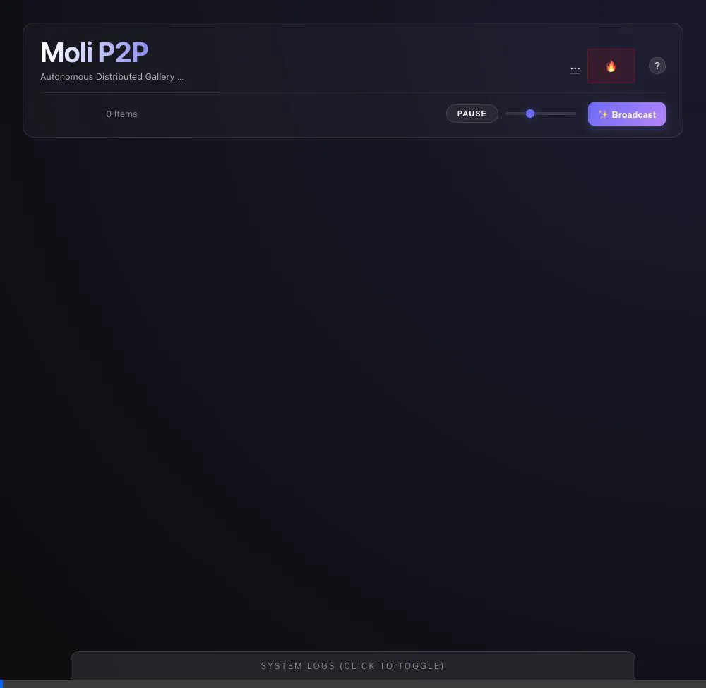

# Moli P2P: The Sovereign Ephemeral Gallery

> **"Presence is Storage." - Use it or lose it.**
> An autonomous, distributed image gallery that lives only as long as you watch it. No central storage, just pure peer-to-peer presence.



**🌍 Live P2P Mesh Network**: **[https://moli-green.is](https://moli-green.is)**
*(This is a fully operational, live public network. Anyone can join immediately.)*

📖 **User Manual (The Handbook)**: **[USER_MANUAL.md](./USER_MANUAL.md)**

---

## 🏕️ Philosophy: Cultivating Our Own Land

We live in an era where we rent digital space from massive platforms. While those platforms have their own valid reasons and ecosystems, the reality remains: **we don't own the land we build on**. 

Moli P2P is an experiment in digital pioneering—cultivating a patch of internet that belongs entirely to the individuals participating in it at any given moment.

1. **Ephemeral by Design (Serverless-ish)**
   There is no cloud storage. The server is merely a "dumb pipe" for signaling. Images exist solely in the browser memory of active peers. If everyone closes their tab, the gallery naturally vanishes.
2. **Sovereignty & Resilience**
   Your computer is your castle. There is no central moderation to ban you, and no central database to be compromised or scraped. You choose what to pin to your Vault and what to let decay.
3. **Organic Network Dynamics**
   The network ebbs and flows with human presence. Content thrives when people care enough to keep it alive by pinning it to their Vault, which acts as a Sovereign Cache to re-seed the network. It is a living exhibition rather than a static archive.

---

## 📜 Changelog / Security Updates

### v1.8.0 Sovereign Cache (River vs Vault)
- **Architecture**: Separated the ephemeral "River" (50 image limit) from the persistent "Vault".
- **Sovereign Seed**: Pinning an image moves it to the Vault and automatically seeds it to the P2P network in the background, keeping the culture alive without creating an unwitting CDN.

### v1.7.10 Sovereign Resilience (2026-02-10)
- **Concurrency**: Implemented "Split Semaphore" architecture (3 Uploads / 3 Downloads) to ensure 100% Full Duplex capability under heavy load.
- **Robustness**: Added exponential backoff retry logic to eliminating startup race conditions ("Signaling Handshake Timed Out").
- **Safety**:
    - **Visual**: All incoming images are blurred by default. Click to reveal.
    - **Local**: "Burn" actions are strictly local bans. No remote censorship.
- **Ephemeral**: Browser holds max **50 images**. Oldest unpinned images decay naturally.

### v1.7.9 Sovereign Update (Deep Security Hardening)
- **Deep Security**:
    - **Pull Semantics**: Client strictly enforces "Pull" logic. Unrequested transfers are blocked at the WebRTC gate.
    - **Global Circuit Breaker**: Server enforces a hard limit on concurrent connections (1000).
    - **Strict Secret Enforcement**: Server refuses to boot without a secure `TURN_SECRET`.
- **Server Hardening**:
    - **Identity Authority**: Server assigns and enforces cryptographic identities, preventing spoofing.
    - **DoS Protection**: Token Bucket rate limiting (10 msg/sec) and strict message size limits (16KB).
    - **Secure Credentials**: Ephemeral TURN credentials signed with HMAC-SHA1 to prevent replay attacks.
- **Sovereign Reset**: New "Danger Modal" for secure identity destruction.
- **Sakoku Policy**: "Burn" actions are strictly local ("My Computer, My Castle"), preventing moderation spam.

## Running Your Own Node (Docker)

You can run a full Moli P2P node (Server + Client) on your own infrastructure (VPS, Raspberry Pi, Laptop) in seconds.

### Prerequisites
- Docker & Docker Compose

### Quick Start

```bash
# 1. Clone the repo
git clone https://github.com/moli-green/moli-p2p.git
cd moli-p2p

# 2. Start the mesh
docker compose up -d
```

That's it.
- **Client**: `http://localhost` (or your server's IP)
- **Signaling**: `http://localhost:9090` (Internal)

> **Note**: This minimal Docker setup ensures the *application* runs, but for connectivity over the internet (NAT Traversal) or mobile 4G, you need a **TURN Server**. See [deployment.md](./deployment.md) for full production setup including Coturn.

## License

**AGPLv3** (GNU Affero General Public License v3.0)

This license ensures that if you run a modified version of this service accessible over a network, you must release the source code. This protects the project from being enclosed by proprietary cloud services.

See [LICENSE](./LICENSE) for details.

## Documentation

- [Deployment Guide](./deployment.md): Detailed production setup (VPS, SSL, TURN).
- [Specification](./spec.md): Technical architecture and protocol details.
